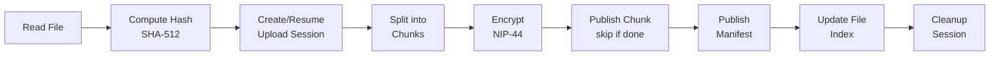
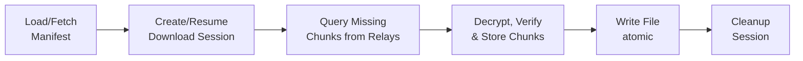
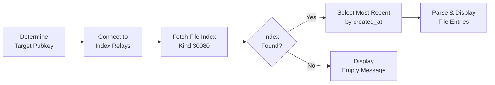
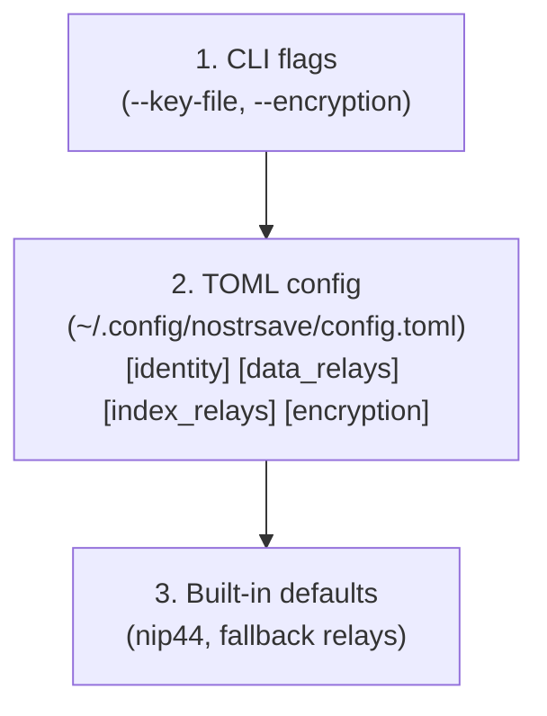
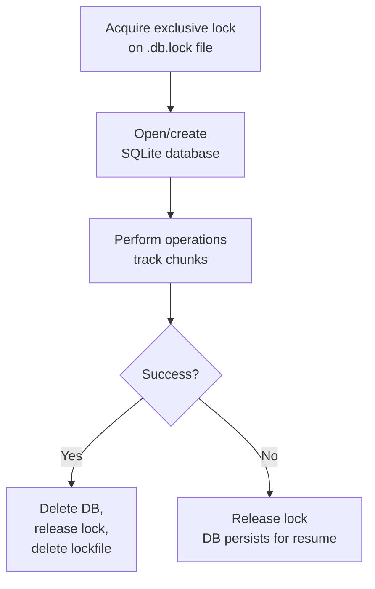

# Architecture

## Data Flow

### Upload Flow



The upload session tracks which chunks have been successfully published. If interrupted, re-running the command skips already-published chunks.

### Download Flow



The download session stores received chunks in SQLite. If interrupted, re-running the command only fetches missing chunks. File assembly happens atomically after all chunks are collected.

### List Flow



The file index is a single replaceable event (Kind 30080) that contains metadata for all uploaded files. When listing:

1. **Target pubkey:** Uses your own pubkey by default, or `--pubkey` to view another user's files
2. **Relay selection:** Queries index relays (not data relays) where manifests are published
3. **Event selection:** If multiple index events exist, the most recent by `created_at` is used
4. **Read-only for others:** You can list any user's files, but only download encrypted files if you have the private key

## Nostr Event Structure

### Chunk Event (Kind 30078)

Parameterized replaceable event storing one file chunk.

```
Kind: 30078
Content: <NIP-44 encrypted or base64-encoded chunk data>
Tags:
  - ["d", "<file_hash>:<chunk_index>"]     # Unique identifier
  - ["x", "<file_hash>"]                   # File hash for filtering
  - ["chunk", "<index>", "<total>"]        # Position info
  - ["hash", "<chunk_hash>"]               # Chunk integrity
  - ["filename", "<name>"]                 # Original filename
  - ["size", "<bytes>"]                    # Chunk size
  - ["encryption", "nip44|none"]            # Encryption algorithm
```

### Manifest Event (Kind 30079)

Parameterized replaceable event containing file metadata.

```
Kind: 30079
Content: <JSON manifest>
Tags:
  - ["d", "<file_hash>"]                   # Unique identifier
  - ["x", "<file_hash>"]                   # For filtering
  - ["filename", "<name>"]                 # Original filename
  - ["size", "<total_bytes>"]              # Total file size
```

**Manifest JSON:**
```json
{
  "version": 1,
  "file_name": "photo.jpg",
  "file_hash": "sha256:abc123...",
  "file_size": 1234567,
  "chunk_size": 32768,
  "total_chunks": 19,
  "created_at": 1704067200,
  "pubkey": "npub1...",
  "encryption": "nip44",
  "chunks": [
    {"index": 0, "event_id": "note1...", "hash": "sha256:..."},
    ...
  ],
  "relays": ["wss://relay.damus.io", ...]
}
```

### File Index Event (Kind 30080)

Parameterized replaceable event listing all user's files.

```
Kind: 30080
Content: <JSON file index>
Tags:
  - ["d", "nostrsave-index"]               # Fixed identifier
```

**Index JSON:**
```json
{
  "version": 1,
  "entries": [
    {
      "file_hash": "sha256:abc123...",
      "file_name": "photo.jpg",
      "file_size": 1234567,
      "uploaded_at": 1704067200,
      "encryption": "nip44"
    },
    ...
  ]
}
```

## Configuration Loading



## Chunking Strategy

- **Default chunk size:** 32 KB (32768 bytes)
- **Maximum:** 65408 bytes (tested limit for reliable relay storage)
- **Range:** 1 KB to 65408 bytes (tested max)
- **Hash algorithm:** SHA-256 (computed on original, unencrypted data)
- **Encryption:** NIP-44 (default) or none; unencrypted data is base64-encoded

### Why Chunking?

1. **Relay limits:** Most relays have event size limits
2. **NIP-44 limits:** Protocol allows up to 65535 bytes, but 65408 is the tested limit that works reliably with relays
3. **Parallel fetching:** Chunks can be fetched concurrently
4. **Resumability:** Failed uploads/downloads can resume
5. **Deduplication:** Identical chunks share the same hash

## Encryption (NIP-44)

Files are encrypted by default using NIP-44 self-encryption:

1. **Self-encryption:** Chunks are encrypted using your secret key + your public key
2. **Only you can decrypt:** Only the owner (matching private key) can decrypt the file
3. **Hash integrity:** File and chunk hashes are computed on original (unencrypted) data
4. **Per-chunk encryption:** Each chunk is encrypted independently
5. **Opt-out available:** Use `--encryption none` to upload unencrypted files

## Relay Discovery

The `discover-relays` command tests relays for file storage capability.

### Relay Sources

1. **nostr.watch API** (`https://api.nostr.watch/v1/online`)
   - Returns list of currently online relays
   - Skipped if `--configured-only` flag is used

2. **Index relays** (from config or built-in defaults)
   - Always included in discovery
   - Typically more reliable for file index storage

### Reliability Criteria

A relay is considered "working" only if ALL conditions pass:

| Criterion | Description |
|-----------|-------------|
| `connected` | WebSocket connection established within timeout |
| `can_write` | Successfully published a test event with NIP-44 encrypted payload |
| `can_read` | Successfully fetched the test event back and verified decryption matches |

The test uses the same event kind (30078) and encryption (NIP-44) as actual file uploads.

### Output Fields

```json
{
  "working_relays": [
    {
      "url": "wss://relay.example.com",
      "connected": true,
      "latency_ms": 150,
      "can_write": true,
      "can_read": true,
      "round_trip_ms": 520,
      "payload_size": 32768
    }
  ],
  "failed_relays": [
    {
      "url": "wss://slow.relay.io",
      "connected": true,
      "latency_ms": 200,
      "can_write": true,
      "can_read": false,
      "round_trip_ms": 8500,
      "payload_size": 32768,
      "error": "Event not found on read"
    }
  ]
}
```

| Field | Description |
|-------|-------------|
| `url` | Relay WebSocket URL |
| `connected` | TCP/WebSocket connection succeeded |
| `latency_ms` | Time to establish connection |
| `can_write` | Event publish succeeded |
| `can_read` | Event fetch and decryption succeeded |
| `round_trip_ms` | Full write→read cycle time |
| `payload_size` | Test payload size (matches `--chunk-size`) |
| `error` | Error message if any test failed |

### Usage with best-relays

The output can be fed to `best-relays` to extract the fastest working relays:

```bash
nostrsave discover-relays -o relays.json
nostrsave best-relays relays.json --count 5
```

## Security Considerations

- **NIP-44 encryption:** File chunks are encrypted by default
- **Self-encryption only:** Only the file owner can decrypt (private key required)
- **Key verification:** Download verifies user's pubkey matches manifest before decryption
- Private keys are never stored in manifests
- Key files support tilde expansion for home directory
- Config file can reference external key files
- Chunk hashes verified on download (against original unencrypted data)
- File hash verified after reassembly

## Session Management

Uploads and downloads use SQLite databases to track progress, enabling resumability after interruptions.

### Session Storage

```
$TMPDIR/nostrsave-sessions/
├── upload_<hash>.db       # Upload session database
├── upload_<hash>.db.lock  # Upload session lock file
├── download_<hash>.db     # Download session database
└── download_<hash>.db.lock # Download session lock file
```

- **Location:** System temp directory (`/tmp/nostrsave-sessions/` on Linux/macOS)
- **Naming:** First 32 characters of file's SHA-512 hash
- **Lifetime:** Automatically deleted on successful completion

### Upload Session Schema

```sql
CREATE TABLE session_meta (
    id INTEGER PRIMARY KEY CHECK (id = 1),
    schema_version INTEGER NOT NULL,
    file_path TEXT NOT NULL,
    file_hash TEXT NOT NULL,
    file_hash_full TEXT NOT NULL,
    file_size INTEGER NOT NULL,
    chunk_size INTEGER NOT NULL,
    total_chunks INTEGER NOT NULL,
    pubkey TEXT NOT NULL,
    encryption TEXT NOT NULL,
    relays TEXT NOT NULL,          -- JSON array
    created_at INTEGER NOT NULL
);

CREATE TABLE published_chunks (
    chunk_index INTEGER PRIMARY KEY,
    event_id TEXT NOT NULL,
    chunk_hash TEXT NOT NULL,
    published_at INTEGER NOT NULL
);
```

### Download Session Schema

```sql
CREATE TABLE session_meta (
    id INTEGER PRIMARY KEY CHECK (id = 1),
    schema_version INTEGER NOT NULL,
    file_hash TEXT NOT NULL,
    file_hash_full TEXT NOT NULL,
    file_name TEXT NOT NULL,
    file_size INTEGER NOT NULL,
    total_chunks INTEGER NOT NULL,
    encryption TEXT NOT NULL,
    manifest_json TEXT NOT NULL,
    output_path TEXT NOT NULL,
    created_at INTEGER NOT NULL
);

CREATE TABLE downloaded_chunks (
    chunk_index INTEGER PRIMARY KEY,
    data BLOB NOT NULL,            -- Decrypted chunk data
    chunk_hash TEXT NOT NULL,
    downloaded_at INTEGER NOT NULL
);
```

### Concurrency Control

Sessions use OS-level advisory file locks via the `fs2` crate:

1. **Lock file:** Separate `.db.lock` file (avoids SQLite locking conflicts)
2. **Exclusive access:** `try_lock_exclusive()` fails immediately if locked
3. **Lock lifetime:** Held for duration of session object
4. **Ordering:** Lock acquired before any database operations



### Error Handling

- **Transient errors** (lock contention, I/O): Retry with delay
- **Corruption errors** (schema mismatch, invalid data): Prompt user to delete
- **`--force` flag:** Skip confirmation prompt for corrupted sessions

## Dependencies

| Crate | Purpose |
|-------|---------|
| nostr-sdk | Nostr protocol implementation (with nip44 feature) |
| clap | CLI argument parsing |
| tokio | Async runtime |
| serde/serde_json | JSON serialization |
| toml | TOML config parsing |
| sha2 | SHA-256/SHA-512 hashing |
| base64 | Binary encoding |
| indicatif | Progress bars |
| reqwest | HTTP client for relay discovery |
| dirs | Platform config directories |
| rusqlite | SQLite database for session tracking |
| fs2 | OS-level file locking for concurrency control |
