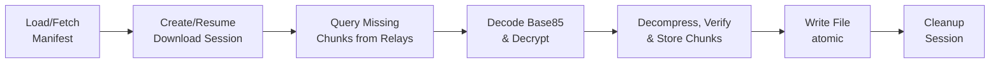
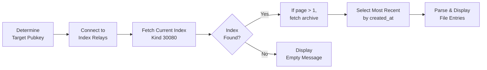
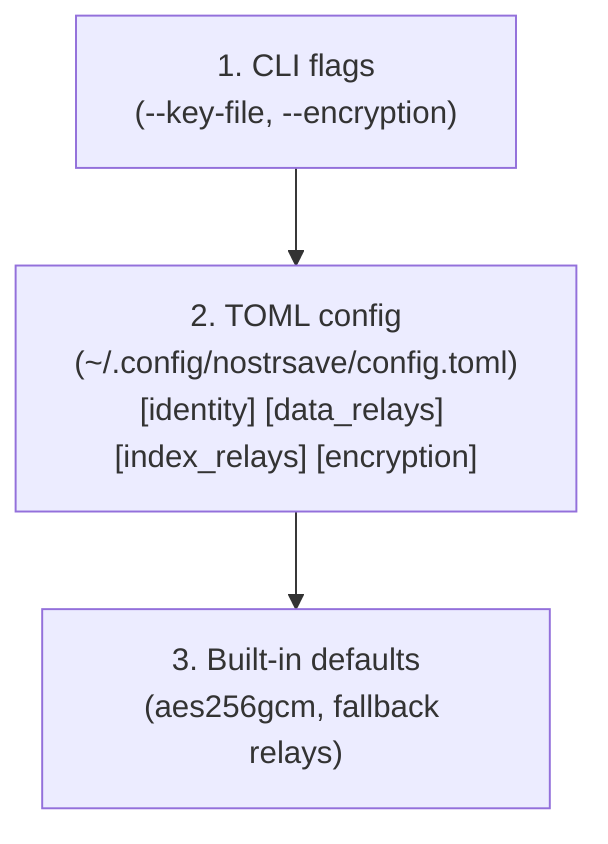

# Architecture

## Data Flow

### Upload Flow

```mermaid
flowchart LR
    A[Read File] --> B[Compute Session Hash<br/>SHA-512]
    B --> C[Create/Resume<br/>Upload Session]
    C --> D[Split into<br/>Chunks]
    D --> E[Compress<br/>Zstd]
    E --> F[Encrypt<br/>AES-256-GCM (default)<br/>or NIP-44]
    F --> G[Base85 Encode<br/>JSON-safe]
    G --> H[Publish Chunk<br/>skip if done]
    H --> I[Publish<br/>Manifest]
    I --> J[Update File<br/>Index]
    J --> K[Cleanup<br/>Session]
```

The upload session tracks which chunks have been successfully published. If interrupted, re-running the command skips already-published chunks.

### Download Flow



The download session stores received chunks in SQLite. If interrupted, re-running the command only fetches missing chunks. File assembly happens atomically after all chunks are collected.

### List Flow (Paged Index)



The file index is **paged** across multiple replaceable events (Kind 30080). Page 1 is the *current* index, and older pages are stored as *archives* with identifiers `nostrsave-index-archive-<n>`. When listing:

1. **Target pubkey:** Uses your own pubkey by default, or `--pubkey` to view another user's files
2. **Relay selection:** Queries index relays (not data relays) where indexes are published
3. **Event selection:** If multiple index events exist, the most recent by `created_at` is used
4. **Read-only for others:** You can list any user's files, but only download encrypted files if you have the private key
5. **Paging:** Page 1 reads the current index (`nostrsave-index`). Page N>1 maps to archive `nostrsave-index-archive-<n>`.

## Nostr Event Structure

### Chunk Event (Kind 30078)

Parameterized replaceable event storing one file chunk.

```
Kind: 30078
Content: `<base85-wrapped payload>`
Tags:
  - ["d", "<file_hash>:<chunk_index>"]     # Unique identifier
  - ["x", "<file_hash>"]                   # File hash for filtering
  - ["chunk", "<index>", "<total>"]        # Position info
  - ["hash", "<chunk_hash>"]               # Chunk integrity
  - ["filename", "<name>"]                 # Original filename
  - ["size", "<bytes>"]                    # Chunk size
  - ["encryption", "aes256gcm|nip44|none"]  # Encryption algorithm

Content encoding:
- If `encryption = aes256gcm`: `base85(aes256gcm_encrypt(zstd(chunk_bytes)))`
- If `encryption = nip44`: `base85(nip44_encrypt(zstd(chunk_bytes)))`
- If `encryption = none`: `base85(zstd(chunk_bytes))`
- Note: zstd checksums are disabled to save space.
```

### Manifest Event (Kind 30079)

Parameterized replaceable event containing file metadata.

```
Kind: 30079
Content: `base85(zstd(<CBOR manifest>))`
Tags:
  - ["d", "<file_hash>"]                   # Unique identifier
  - ["x", "<file_hash>"]                   # For filtering
  - ["filename", "<name>"]                 # Original filename
  - ["size", "<total_bytes>"]              # Total file size
```

**Manifest CBOR (before zstd + base85):**

Short keys + binary fields are used for size efficiency:

| Key | Type | Description |
|-----|------|-------------|
| `v` | uint | version |
| `f` | text | file_name |
| `h` | bytes(32) | file_hash (raw bytes) |
| `s` | uint | file_size |
| `c` | uint | chunk_size |
| `n` | uint | total_chunks |
| `t` | uint | created_at |
| `p` | bytes(32) | pubkey (raw bytes) |
| `e` | uint | encryption (0=aes256gcm, 1=nip44, 2=none) |
| `r` | array(text) | relays |
| `k` | array | chunks |

Chunks array entries are objects with:

| Key | Type | Description |
|-----|------|-------------|
| `i` | uint | index |
| `e` | bytes(32) | event_id (raw bytes) |
| `h` | bytes(32) | hash (raw bytes) |

**Manifest JSON (local file / `--output`):**
```json
{
  "version": 3,
  "file_name": "photo.jpg",
  "file_hash": "abc123...",
  "file_size": 1234567,
  "chunk_size": 32768,
  "total_chunks": 19,
  "created_at": 1704067200,
  "pubkey": "npub1...",
  "encryption": "aes256gcm",
  "chunks": [
    {"index": 0, "event_id": "note1...", "hash": "def123..."},
    ...
  ],
  "relays": ["wss://relay.damus.io", ...]
}
```

### File Index Event (Kind 30080, paged)

Parameterized replaceable events listing a user's files across pages. Index content is zstd-compressed and base85-encoded.

```
Kind: 30080
Content: `base85(zstd(<JSON file index>))`
Tags:
  - ["d", "nostrsave-index"]               # Current index (page 1)
  - ["d", "nostrsave-index-archive-<n>"]   # Archive pages (n >= 1)
```

**Index JSON:**
```json
{
  "version": 3,
  "entries": [
    {
      "file_hash": "abc123...",
      "file_name": "photo.jpg",
      "file_size": 1234567,
      "uploaded_at": 1704067200,
      "encryption": "aes256gcm"
    },
    ...
  ],
  "archive_number": 0,
  "total_archives": 2
}
```

**Notes:**
- `archive_number` is `0` for the current index (page 1). Archives start at `1`.
- `total_archives` is the total number of archive pages (not counting the current index).
- No backward compatibility: only version `3` indexes are supported.

## Configuration Loading



## Chunking Strategy

- **Default chunk size:** 32 KB (32768 bytes)
- **Maximum:** 65408 bytes (tested limit for reliable relay storage)
- **Range:** 1 KB to 65408 bytes (tested max)
- **Hash algorithm:** SHA-256 (computed on original, unencrypted data)
- **Compression:** Zstd (per-chunk, before optional encryption). Checksums disabled.
- **Encoding:** Base85 (Z85) JSON-safe payload wrapping
- **Encryption:** AES-256-GCM (default), NIP-44, or none
- **Decompression safety:** Decompressed payloads are capped at 10 MiB to prevent memory exhaustion

### Why Chunking?

1. **Relay limits:** Most relays have event size limits
2. **NIP-44 limits:** Protocol allows up to 65535 bytes, but 65408 is the tested limit that works reliably with relays
3. **Resumability:** Failed uploads/downloads can resume
4. **Deduplication:** Identical chunks share the same hash
5. **Streaming-friendly:** Chunks are processed as events arrive per relay (sequential across relays)

## Encryption

Choose one of three modes via `--encryption <MODE>`:

- **AES-256-GCM (Default):**
  - **Key Derivation:** HKDF-SHA256 derived from the Nostr secret key alone
  - **Structure:** `[nonce (12B)][ciphertext][tag (16B)]`
  - **Integrity:** Authenticated encryption ensures data integrity

- **NIP-44:**
  - **Key Derivation:** Self-encryption using secret key + own public key
  - **Structure:** Standard NIP-44 format (ChaCha20-Poly1305 + HMAC-SHA256 for v2)
  - **Integrity:** Authenticated encryption (HMAC-SHA256)

- **None:**
  - **No encryption:** Data is compressed but not encrypted
  - **Integrity:** Nostr event signatures + chunk hash tags (no authenticated encryption)
  - **Use case:** Public files where privacy is not required

When encrypted (AES-256-GCM or NIP-44):
1. **Owner-only decryption:** Only the owner (matching private key) can decrypt
2. **Per-chunk encryption:** Each chunk is encrypted independently
3. **Hash integrity:** File and chunk hashes are computed on original (unencrypted) data

## Relay Discovery

The `discover-relays` command tests relays for file storage capability.

### Relay Sources

Use `--relay-source <SOURCE>` to select discovery method:

1. **nostrwatch** - nostr.watch API (`https://api.nostr.watch/v1/online`)
   - Returns list of currently online relays
   - Also includes configured index relays

2. **configured-only** - Index relays only
   - Tests only the configured index relays (from config or built-in defaults)

3. **index-relays** - NIP-66/NIP-65 discovery
   - Queries index relays for relay discovery events (NIP-66, kind 30166)
   - Also fetches user relay lists (NIP-65, kind 10002)
   - Discovers relays published by relay monitors and users

Single relay mode: `nostrsave discover-relays wss://relay.example.com`
- Tests one relay and outputs JSON to stdout (no file saved)

### Reliability Criteria

A relay is considered "working" only if ALL conditions pass:

| Criterion | Description |
|-----------|-------------|
| `connected` | WebSocket connection established within timeout |
| `can_write` | Successfully published a test event with NIP-44 encrypted payload |
| `can_read` | Successfully fetched the test event back and verified decryption matches |

The test uses the same event kind (30078), encryption (NIP-44), and chunk event tag structure as actual file uploads.

### Output Fields

```json
{
  "working_relays": [
    {
      "url": "wss://relay.example.com",
      "connected": true,
      "latency_ms": 150,
      "can_write": true,
      "can_read": true,
      "round_trip_ms": 520,
      "payload_size": 32768
    }
  ],
  "failed_relays": [
    {
      "url": "wss://slow.relay.io",
      "connected": true,
      "latency_ms": 200,
      "can_write": true,
      "can_read": false,
      "round_trip_ms": 8500,
      "payload_size": 32768,
      "error": "Event not found on read"
    }
  ]
}
```

| Field | Description |
|-------|-------------|
| `url` | Relay WebSocket URL |
| `connected` | TCP/WebSocket connection succeeded |
| `latency_ms` | Time to establish connection |
| `can_write` | Event publish succeeded |
| `can_read` | Event fetch and decryption succeeded |
| `round_trip_ms` | Full write→read cycle time |
| `payload_size` | Test payload size (matches `--chunk-size`) |
| `error` | Error message if any test failed |

### Usage with best-relays

The output can be fed to `best-relays` to extract the fastest working relays:

```bash
nostrsave discover-relays --relay-source nostrwatch
nostrsave best-relays relays-nostrwatch.json --count 5
```

Output files are named with a source suffix: `relays-nostrwatch.json`, `relays-configured.json`, `relays-index.json`.

### Persisted Discovered Relays (for Upload Rotation)

In bulk mode, `discover-relays` also writes the ordered list of working relays (fastest first) into a SQLite database named `data_relays.sqlite3` in the same directory as your `config.toml`.

When your config sets:

```toml
[data_relays]
source = "discovered"
batch_size = 6
```

uploads will select the next `batch_size` relays from that saved list (e.g., 1–6, then 7–12, etc). The DB tracks:

- `discovered_relays.last_used_at` (timestamp of last selection)
- a rolling cursor (`relay_selection_state.next_offset`) to ensure the next upload continues from the next slice

## Security Considerations

- **NIP-44 encryption:** File chunks are encrypted by default
- **Self-encryption only:** Only the file owner can decrypt (private key required)
- **Key verification:** Download verifies user's pubkey matches manifest before decryption
- Private keys are never stored in manifests
- Key files support tilde expansion for home directory
- Config file can reference external key files
- Chunk hashes recomputed on download and stored in the session (final integrity check is the file hash after reassembly)
- File hash verified after reassembly

## Session Management

Uploads and downloads use SQLite databases to track progress, enabling resumability after interruptions.

### Session Storage

```
$TMPDIR/nostrsave-sessions/
├── upload_<hash>.db       # Upload session database
├── upload_<hash>.db.lock  # Upload session lock file
├── download_<hash>.db     # Download session database
└── download_<hash>.db.lock # Download session lock file
```

- **Location:** System temp directory (`/tmp/nostrsave-sessions/` on Linux/macOS)
- **Naming:** First 32 characters of file's SHA-512 hash
- **Lifetime:** Automatically deleted on successful completion

### Upload Session Schema

```sql
CREATE TABLE session_meta (
    id INTEGER PRIMARY KEY CHECK (id = 1),
    schema_version INTEGER NOT NULL,
    file_path TEXT NOT NULL,
    file_hash TEXT NOT NULL,
    file_hash_full TEXT NOT NULL,
    file_size INTEGER NOT NULL,
    chunk_size INTEGER NOT NULL,
    total_chunks INTEGER NOT NULL,
    pubkey TEXT NOT NULL,
    encryption TEXT NOT NULL,
    relays TEXT NOT NULL,          -- JSON array
    created_at INTEGER NOT NULL
);

CREATE TABLE published_chunks (
    chunk_index INTEGER PRIMARY KEY,
    event_id TEXT NOT NULL,
    chunk_hash TEXT NOT NULL,
    published_at INTEGER NOT NULL
);
```

### Download Session Schema

```sql
CREATE TABLE session_meta (
    id INTEGER PRIMARY KEY CHECK (id = 1),
    schema_version INTEGER NOT NULL,
    file_hash TEXT NOT NULL,
    file_hash_full TEXT NOT NULL,
    file_name TEXT NOT NULL,
    file_size INTEGER NOT NULL,
    total_chunks INTEGER NOT NULL,
    encryption TEXT NOT NULL,
    manifest_json TEXT NOT NULL,
    output_path TEXT NOT NULL,
    created_at INTEGER NOT NULL
);

CREATE TABLE downloaded_chunks (
    chunk_index INTEGER PRIMARY KEY,
    data BLOB NOT NULL,            -- Decrypted chunk data
    chunk_hash TEXT NOT NULL,
    downloaded_at INTEGER NOT NULL
);
```

### Concurrency Control

Sessions use OS-level advisory file locks via the `fs2` crate:

1. **Lock file:** Separate `.db.lock` file (avoids SQLite locking conflicts)
2. **Exclusive access:** `try_lock_exclusive()` fails immediately if locked
3. **Lock lifetime:** Held for duration of session object
4. **Ordering:** Lock acquired before any database operations


### Error Handling

- **Transient errors** (lock contention, I/O): Retry with delay
- **Corruption errors** (schema mismatch, invalid data): Prompt user to delete
- **`--force` flag:** Skip confirmation prompt for corrupted sessions

## Dependencies

| Crate | Purpose |
|-------|---------|
| nostr-sdk | Nostr protocol implementation (with nip44 feature) |
| aes-gcm | AES-256-GCM encryption |
| hkdf | HMAC-based Key Derivation Function |
| clap | CLI argument parsing |
| tokio | Async runtime |
| serde/serde_json | JSON serialization |
| toml | TOML config parsing |
| sha2 | SHA-256/SHA-512 hashing |
| base64 | Binary encoding |
| indicatif | Progress bars |
| reqwest | HTTP client for relay discovery |
| dirs | Platform config directories |
| rusqlite | SQLite database for session tracking |
| fs2 | OS-level file locking for concurrency control |
